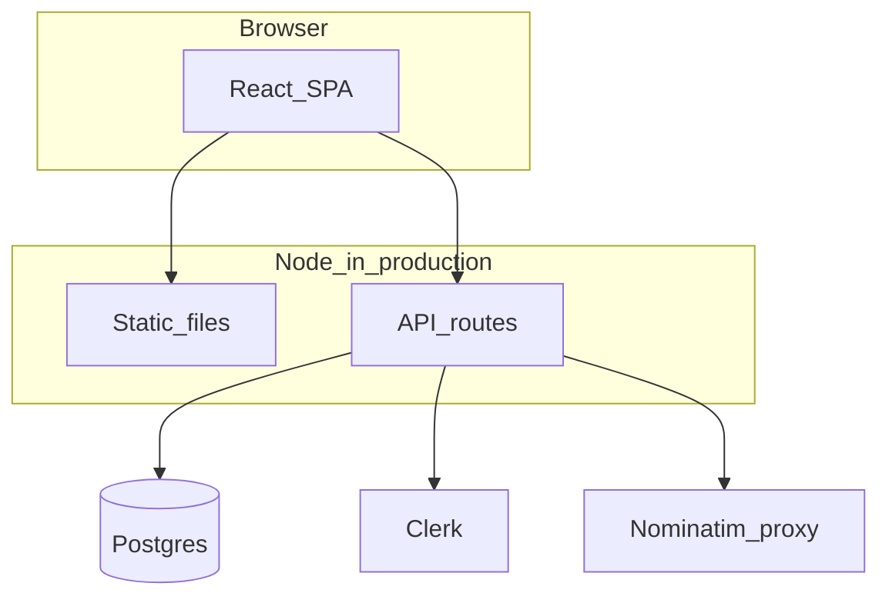

# NearFix

[](LICENSE)
[](https://github.com/tarunkauxhik/NearFix/blob/main/package.json)

**By [Tarun Kaushik](https://github.com/tarunkauxhik)** · [This repository](https://github.com/tarunkauxhik/NearFix)

A public **portfolio project**: a demo-style **hyperlocal services marketplace** (India-flavoured UX) built to showcase a modern full-stack TypeScript setup—browse providers, filter by area and category, walk through booking UI, and explore role-aware dashboards. **Clerk** handles auth; **Postgres + Drizzle** back bookings and related tables. Provider listings still lean on **mock JSON** in places; treat persistence and polish as ongoing.

---

## Live demo

_Add your production URL here after deploy (e.g. `https://your-app.onrender.com`)._

---

## Features

- Marketing home, service discovery, and provider detail pages  
- Clerk sign-in / sign-up and post-auth routing  
- Booking flow (UI) and confirmation  
- Resident and provider dashboards  
- Admin area for user management (role-gated)  
- Server-backed geocode helpers for location-aware discovery (“near me”)  
- **`/api/*`** routes alongside Vite in dev; one Node server serves UI + API in production  

---

## Tech stack

React 19 · TypeScript · Vite 6 · React Router 7 · Tailwind CSS · Radix/shadcn-style UI · TanStack Query · Clerk · Express (file-based API via `vite-plugin-api-routes`) · Drizzle ORM · Postgres · Vitest · ESLint  

---

## Quick start

```bash
git clone https://github.com/tarunkauxhik/NearFix.git
cd NearFix
cp env.example .env
# Edit .env: set DATABASE_URL, VITE_CLERK_PUBLISHABLE_KEY, CLERK_SECRET_KEY
npm install
npm run dev
```

Open **http://localhost:5173** (unless you set `PORT` / `HOST` in `.env`).

---

## Architecture



The browser calls **`/api/...`** on the same origin. Production runs **`npm run build`** then **`npm start`**, which serves the built client and mounts the API on the same process (see [`scripts/run-prod.mjs`](scripts/run-prod.mjs)).

---

## Environment variables

**Required for local dev:** `DATABASE_URL`, `VITE_CLERK_PUBLISHABLE_KEY`, `CLERK_SECRET_KEY`.

**Common for production:** the same three, plus **`VITE_PUBLIC_URL`** set to your public `https://` URL (rebuild after changing any `VITE_*` on the host). Optional: `NOMINATIM_EMAIL` / `NOMINATIM_USER_AGENT`, admin bootstrap vars, and dev-only CORS helpers—see [`env.example`](env.example).

Copy [`env.example`](env.example) to `.env` and fill in values—**never commit `.env`**.

---

## Database

Schema lives in [`src/server/db/schema.ts`](src/server/db/schema.ts). With `DATABASE_URL` set in `.env`:

```bash
npx drizzle-kit push
```

For versioned SQL migrations: `npx drizzle-kit generate` ([Drizzle Kit](https://orm.drizzle.team/kit-docs/overview)).

---

## Scripts

| Command | Description |
| --- | --- |
| `npm run dev` | Vite + API routes (development) |
| `npm run build` | Production client + server bundle |
| `npm start` | Run production server (after `build`) |
| `npm run preview` | Preview client build via Vite |
| `npm run type-check` | TypeScript check |
| `npm run lint` | ESLint |
| `npm run test` | Vitest |

---

## Deploy (short)

1. Set the same environment variables on your host as in `.env` (especially Clerk and `DATABASE_URL`).  
2. Run **`npm ci`** (or **`npm install`**) then **`npm run build`**.  
3. Start with **`npm start`** (see `env.example` for `PORT` / `SERVER_*`).  

**Full step-by-step (Render, Clerk, Drizzle, Docker):** see [DEPLOY.md](DEPLOY.md).

Host docs: [Render](https://render.com/docs) · [Railway](https://docs.railway.app).

---

## Contributing

This is a **personal showcase repo**; forks and small PRs are welcome if something is broken for local setup. For larger changes, open an issue first so direction stays aligned.

---

## Acknowledgments

- [Clerk](https://clerk.com) for authentication  
- [Neon](https://neon.tech) or any Postgres host for `DATABASE_URL`  
- [OpenStreetMap Nominatim](https://nominatim.org/) (used via a small server-side proxy)  

---

## License

MIT — see [LICENSE](LICENSE).
