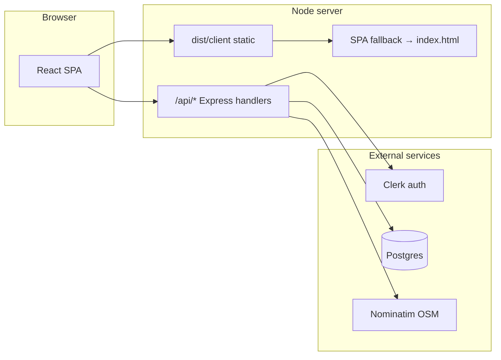

# NearFix

NearFix is a hyperlocal services marketplace for India: discover and book verified electricians, plumbers, tutors, beauticians, AC technicians, carpenters, and related trades from a single React application.

This repository contains:

- A **React 19 + Vite 6** single-page application with client-side routing.
- A **thin Express layer** generated from file-based API routes (`vite-plugin-api-routes`).
- A **Postgres + Drizzle ORM** data layer for bookings, reviews, saved providers, and provider applications.
- **Clerk** for authentication and session-backed API calls.

The production runtime is a **single Node process** that serves the built static client, exposes `/api/*`, and falls back to `index.html` for SPA deep links.

---

## Architecture at a glance



- The browser calls APIs with **relative URLs** (`/api/...` via `src/lib/api-client.ts`), so **same-origin deployment** is the intended model: no separate API subdomain is required for the default setup.
- **Geocoding** (reverse and search) is proxied through your server (`/api/geocode/*`) so the client does not call OpenStreetMap Nominatim directly (avoids CORS and keeps a consistent `User-Agent` / usage policy surface).
- **Location for discovery** is free text on home and services pages, plus optional **“Near me”** resolution into a human-readable label stored with the session flow (`UseMyLocationButton`, `useNearFixLocation`). Global header no longer duplicates location controls.

---

## Tech stack

| Layer | Choice |
| --- | --- |
| UI | React 19, TypeScript, Vite 6 |
| Routing | React Router 7 (`src/routes.tsx`, typed helpers in `src/router.ts`) |
| Styling | Tailwind CSS 3, shadcn/ui (Radix), `tailwind-merge` |
| Motion | `motion` (Framer Motion API) |
| Data fetching | TanStack Query |
| Local UI state | Zustand where needed |
| Forms | react-hook-form + Zod |
| Auth | `@clerk/clerk-react` + `@clerk/backend` on the server |
| API | Express 5 via `vite-plugin-api-routes` (`src/server/api/**`) |
| Database | Postgres (`pg`) + Drizzle ORM (`src/server/db/`) |
| Quality | Vitest, Testing Library, ESLint 9, Prettier |

---

## Prerequisites

| Requirement | Notes |
| --- | --- |
| **Node.js 22+** | Enforced in `package.json` `engines`. Run `node --version`. |
| **Postgres** | Connection string compatible with Neon, Supabase, RDS, or local Postgres. |
| **Clerk application** | [Clerk Dashboard](https://dashboard.clerk.com): publishable + secret keys; configure production URLs before go-live. |

Optional but recommended for geocode-heavy usage:

- **`NOMINATIM_EMAIL`** (or `VITE_NOMINATIM_EMAIL`) — contact hint for [Nominatim usage policy](https://operations.osmfoundation.org/policies/nominatim/).

---

## Quick start (local)

```bash
git clone <repository-url>
cd NearFix

cp env.example .env
# Edit .env: DATABASE_URL, VITE_CLERK_PUBLISHABLE_KEY, CLERK_SECRET_KEY (see table below)

npm install
npm run dev
```

Open **http://localhost:5173** (or the host/port from `PORT` / `HOST` in `.env`).

### Database schema

Generate SQL from the Drizzle schema or push directly (development convenience):

```bash
npx drizzle-kit generate   # writes SQL under drizzle/ from src/server/db/schema.ts
npx drizzle-kit push         # applies schema to DATABASE_URL (requires .env)
```

---

## Environment variables

Values marked **client** are embedded in the Vite bundle at build time (`VITE_*`). **Server** variables must exist in the runtime environment of `node dist/server.bundle.mjs` (or your process manager).

| Variable | Scope | Purpose |
| --- | --- | --- |
| `DATABASE_URL` | Server | Postgres connection string (SSL-friendly URLs work with Neon). |
| `VITE_CLERK_PUBLISHABLE_KEY` | Client | Clerk publishable key; **required** at build and runtime validation in `main.tsx`. |
| `CLERK_SECRET_KEY` | Server | Clerk secret for verifying JWTs on API routes. |
| `VITE_PUBLIC_URL` | Server (optional) | Canonical site URL; used with request origin for Clerk **authorized parties** in `src/server/lib/clerk.ts`. Set to your production HTTPS URL. |
| `VITE_APP_NAME` | Client | Display name (defaults in `env.example`). |
| `VITE_API_URL` | Client | Documented for completeness; the app uses relative `/api` in `api-client.ts`. |
| `ADMIN_EMAILS` | Server | Comma-separated emails matching Clerk users → bootstrap admin for `/admin/*`. |
| `ADMIN_USERNAMES` | Server | Comma-separated Clerk usernames → bootstrap admin. |
| `ADMIN_USER_IDS` | Server | Comma-separated Clerk user ids (`user_...`) → bootstrap admin. |
| `SERVER_HOST` | Server | Host interface for the production API/static server (default `127.0.0.1` in plugin defaults). **Use `0.0.0.0` on PaaS** so the container accepts external traffic. |
| `SERVER_PORT` | Server | Listen port for the bundled server. **`npm start`** sets `SERVER_PORT` from **`PORT`** when `SERVER_PORT` is unset (Railway, Render, Fly). |
| `PORT` | Server | Common PaaS convention; consumed by `scripts/run-prod.mjs` → `SERVER_PORT`. |
| `FRONTEND_DOMAIN` | Build / dev | Parsed in `vite.config.ts` for `allowedHosts` and dev CORS when splitting front/back during development. |
| `ALLOWED_ORIGINS` | Build / dev | Comma-separated extra origins for dev server CORS / allowed hosts. |
| `VITE_PARENT_ORIGIN` | Build / dev | Optional parent origin for Clerk or iframe scenarios. |
| `NOMINATIM_EMAIL` | Server | Appended to reverse geocode requests (good citizenship / policy). |
| `NOMINATIM_USER_AGENT` | Server | Overrides default User-Agent string for Nominatim. |

Never commit real `.env` files. Copy from `env.example` only.

---

## Project structure

```
NearFix/
├── scripts/
│   └── run-prod.mjs          # Maps PORT→SERVER_PORT; default SERVER_HOST for PaaS
├── public/                   # Static files (favicon, robots.txt)
├── drizzle/                  # Generated SQL migrations (after drizzle-kit generate)
├── src/
│   ├── components/           # Shared UI, including location/ and MapPlaceholder
│   ├── data/                 # Mock providers & demo content
│   ├── layouts/              # Root layout, marketing shell, Header, Footer
│   ├── pages/                # Route screens (home, services, booking, dashboards, admin)
│   ├── server/
│   │   ├── api/              # File-based HTTP handlers → /api/...
│   │   ├── db/               # Drizzle schema, client, migrations entry
│   │   ├── lib/              # Clerk helpers, env bootstrap
│   │   └── configure.js      # Express middleware: static + SPA fallback + shutdown hooks
│   ├── lib/                  # api-client, provider-discovery, location helpers, access control
│   ├── styles/globals.css
│   ├── App.tsx               # Router shell, cookie banner, global providers
│   ├── main.tsx              # Clerk + QueryClient bootstrap
│   └── routes.tsx            # Route table
├── drizzle.config.ts
├── vite.config.ts            # React, API routes plugin, manualChunks, server bundle (esbuild)
├── tailwind.config.js
├── env.example
└── package.json
```

---

## HTTP API surface (`/api`)

| Method | Path | Purpose |
| --- | --- | --- |
| `GET` | `/api/health` | Liveness / JSON status for uptime checks. |
| `GET` | `/api/auth/me` | Authenticated viewer summary (Clerk-backed). |
| `POST` | `/api/user/role` | Role assignment / onboarding-related updates. |
| `GET` | `/api/provider/profile` | Fetch provider application profile. |
| `POST` | `/api/provider/profile` | Submit or update provider application. |
| `GET` | `/api/geocode/reverse` | Server proxy: lat/lon → locality labels (Nominatim). |
| `GET` | `/api/geocode/search` | Server proxy: forward geocode search. |
| `GET` | `/api/admin/users` | Admin: list users (protected). |
| `POST` | `/api/admin/users/metadata` | Admin: metadata updates. |
| `GET` | `/api/account/export` | Account data export (authenticated). |
| `POST` | `/api/account/delete` | Account deletion flow (authenticated). |

All routes are implemented under `src/server/api/` as individual modules consumed by the plugin.

---

## NPM scripts

| Command | Description |
| --- | --- |
| `npm run dev` | Vite dev server + hot API routes. |
| `npm run build` | Client build to `dist/client/` + SSR/API bundle → `dist/server.bundle.mjs`. |
| `npm start` | Production: `scripts/run-prod.mjs` then the bundled server (use after `build`). |
| `npm run preview` | Preview production client via Vite (differs from full `npm start` stack). |
| `npm run test` | Vitest. |
| `npm run lint` / `lint:fix` | ESLint. |
| `npm run type-check` | `tsc --noEmit`. |
| `npm run format` | Prettier on `src/**/*.{ts,tsx,json,md}`. |

---

## Production build

1. Set environment variables available to the **build** step for anything prefixed with `VITE_` (typically injected by your host’s “build command” environment).
2. Run:

```bash
npm ci
npm run build
```

Artifacts:

- **`dist/client/`** — static assets and `index.html`.
- **`dist/server.bundle.mjs`** — single ESM bundle that starts Express, registers API handlers, serves static files, and applies SPA fallback.

3. Start:

```bash
npm start
```

`scripts/run-prod.mjs` ensures:

- If the platform sets **`PORT`** (Render, Railway, Heroku-style) and **`SERVER_PORT`** is not set, **`SERVER_PORT`** is set to that value.
- If **`SERVER_HOST`** is unset, it defaults to **`0.0.0.0`** so the process accepts traffic from the load balancer.

You can still override explicitly with `SERVER_HOST` and `SERVER_PORT` in any environment.

---

## Deployment guide

### Where to deploy (recommended options)

| Platform | Why it fits NearFix | Typical pattern |
| --- | --- | --- |
| **[Render](https://render.com)** | Free tier Web Service, native `PORT`, managed TLS, Postgres add-on or external Neon. | Docker or native Node; build → start. |
| **[Railway](https://railway.app)** | Simple Git deploy, `PORT` injection, add Postgres plugin. | Nixpacks detects Node; set env vars in dashboard. |
| **[Fly.io](https://fly.io)** | Global edge, full Docker control. | Dockerfile runs `node scripts/run-prod.mjs` after `npm run build`. |
| **VPS (Ubuntu, etc.)** | Maximum control. | `systemd` unit calling `npm start` behind Caddy/nginx reverse proxy + TLS. |

**Split static + serverless functions** (e.g. pure Vercel static + separate functions for every Express route) is **not** how this repo is wired today; the happy path is **one Node service** serving both UI and `/api`.

### Render (Web Service)

1. Create a **Web Service** connected to this repo.
2. **Build command:** `npm ci && npm run build`
3. **Start command:** `npm start`
4. **Environment** (minimum): `DATABASE_URL`, `VITE_CLERK_PUBLISHABLE_KEY`, `CLERK_SECRET_KEY`, `VITE_PUBLIC_URL` (your `https://...` service URL), `NODE_ENV=production`
5. Attach **Postgres** or point `DATABASE_URL` to Neon.
6. Run migrations from your machine or a one-off job: `DATABASE_URL=... npx drizzle-kit push`
7. In **Clerk Dashboard → Domains**, add your Render hostname and configure redirect URLs for sign-in/up.

Health check path: **`/api/health`**.

### Railway

1. New Project → Deploy from GitHub.
2. Add variables (same as Render). Railway provides `PORT`; `npm start` maps it automatically.
3. Set **Root directory** if the repo is monorepo (here: repo root).
4. Custom **Deploy** → default Nixpacks `npm install` + set build to `npm run build` if needed in `railway.json` or UI.
5. Run Drizzle push from local CI or Railway’s shell with `DATABASE_URL`.

### Fly.io (outline)

1. `fly launch` after adding a `Dockerfile` that:
   - Uses `node:22-alpine`
   - Copies project, runs `npm ci && npm run build`
   - `CMD ["npm", "start"]`
2. Set secrets: `fly secrets set DATABASE_URL=... CLERK_SECRET_KEY=... VITE_CLERK_PUBLISHABLE_KEY=...`

### Clerk production checklist

- Add production domain to **Clerk → Configure → Domains**.
- Set **Authorized redirect / after sign-in URLs** to match your deployed origin (`VITE_PUBLIC_URL` should align).
- Rotate from `pk_test_` / `sk_test_` to **`pk_live_` / `sk_live_`** when you are ready for real users.
- Ensure `VITE_PUBLIC_URL` matches the HTTPS URL users see (helps backend token verification options).

### SEO and robots

- `public/robots.txt` currently contains **`Disallow: /`** — appropriate for staging; **replace with an allow policy** before marketing go-live.
- In development, `main.tsx` injects `<meta name="robots" content="noindex, nofollow">`; production builds do not add that meta automatically from the same branch—still verify with your hosting.

---

## Operations

- **Logs:** Standard `stdout` / `stderr` from Express and route handlers; watch for Nominatim `502` responses if upstream throttles.
- **Graceful shutdown:** `configure.js` listens for `SIGTERM` / `SIGINT` and attempts to close the DB pool when the Drizzle client module loads successfully.
- **Scaling:** The app is stateless at the HTTP layer aside from DB; scale horizontally only after verifying Clerk token verification and DB connection limits (use a pooler such as **Neon pooler** or **PgBouncer** for many instances).

---

## Known gaps and roadmap (non-exhaustive)

- Footer “Company” / “Support” links may still be placeholders until dedicated pages exist.
- Provider imagery may rely on placeholders (e.g. generated avatars) until real media is integrated.
- Booking UX may navigate client-side; ensure any persistence you need is wired to the `bookings` table and tested end-to-end.
- Admin access: prefer Clerk `private_metadata.role = "admin"` in production; env-based bootstrap is for early setup only.

---

## Recent UX / product direction (high level)

- **Discovery location** is a **free-text area** on home and services (no hard-coded city dropdown).
- **“Near me”** resolves coordinates to a label on the button itself and can populate the text field.
- **Map placeholder** remains a branded static preview (no API key banner in-product).
- **Header** focuses on navigation and account; location is contextual to discovery surfaces.

---

## License

MIT.
